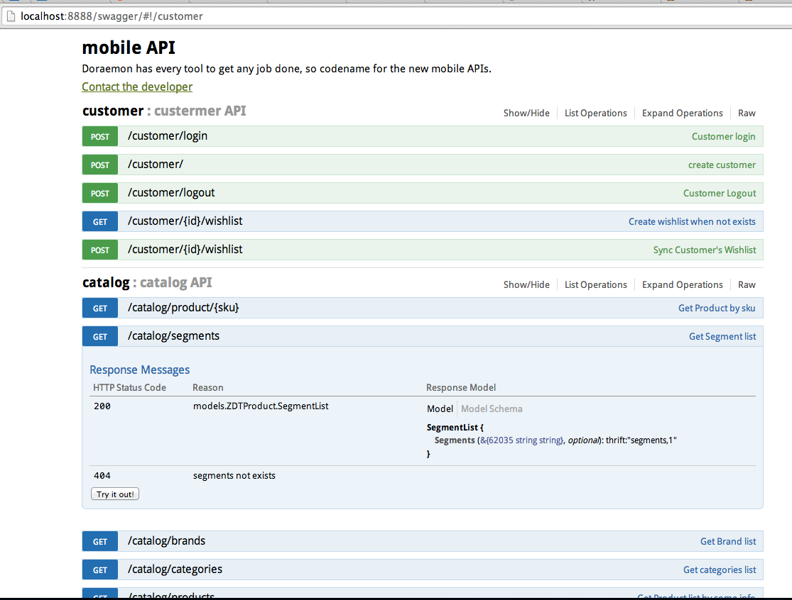
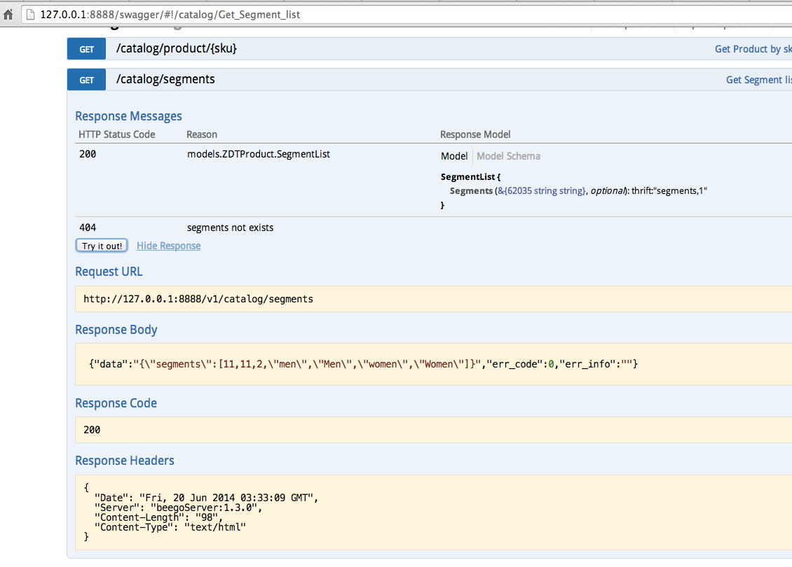

<!DOCTYPE html>
<html>
	<head>
		<meta charset="utf-8">
<meta http-equiv="X-UA-Compatible" content="IE=edge">
<meta name="viewport" content="width=device-width, initial-scale=1.0, maximum-scale=1.0, user-scalable=no">
<meta name="author" content="slene, Unknown" />

<title>Automated API Documentation - beego: simple &amp; powerful Go app framework</title>

<link rel="shortcut icon" href="/static/img/favicon.png" />


<script>/* Beego Compress group `lib` begin */</script>
	<link rel="stylesheet" href="/static_source/css/bootstrap.css?ver=1409586500" />
	<link rel="stylesheet" href="/static_source/css/bootstrap-theme.css?ver=1409586500" />
	<link rel="stylesheet" href="/static_source/css/font-awesome.min.css?ver=1409586500" />
	<link rel="stylesheet" href="/static_source/css/prettify.css?ver=1409586500" />
	<link rel="stylesheet" href="/static_source/css/select2.css?ver=1409586500" />
	<script>/* end */</script>
<!--[if IE 7]>
<script>/* Beego Compress group `ie7` begin */</script>
	<link rel="stylesheet" href="/static_source/css/font-awesome-ie7.min.css?ver=1409586500" />
	<script>/* end */</script>
<![endif]-->
<script>/* Beego Compress group `app` begin */</script>
	<link rel="stylesheet" href="/static_source/css/base.css?ver=1409586500" />
	<link rel="stylesheet" href="/static_source/css/markdown.css?ver=1409586500" />
	<link rel="stylesheet" href="/static_source/css/main.css?ver=1409586500" />
	<script>/* end */</script>

<!--[if lt IE 9]>
	<script>/* Beego Compress group `ie9` begin */</script>
	<script type="text/javascript" src="/static_source/js/html5shiv.js?ver=1409586500"></script>
	<script type="text/javascript" src="/static_source/js/respond.min.js?ver=1409586500"></script>
	<script>/* end */</script>
<![endif]-->
		
	</head>
	<body id="front">
		<noscript>Please enable JavaScript in your browser!</noscript>
		<div id="wrapper">
			<nav class="navbar navbar-default navbar-fixed-top">
    <div class="container" data-toggle="clingify">
        <div class="row">
            <div class="navbar-header">
                
                <span class="visible-xs">
                    <a id="docs-collapse-btn" class="navbar-btn" data-toggle="jpanel-menu" data-target="#docs-collapse">
                        <span class="sr-only">Toggle docs menu</span>
                        <i class="icon icon-angle-right"></i>
                    </a>
                </span>
                
                <a type="button" class="navbar-toggle" data-toggle="collapse" data-target="#navbar-collapse">
                    <span class="sr-only">Toggle navigation</span>
                    <span class="icon-bar"></span>
                    <span class="icon-bar"></span>
                    <span class="icon-bar"></span>
                </a>
                <a class="hidden-xs logo" href="/">
                    
                </a>
                <div class="visible-xs text-center">
                    <a class="navbar-brand" href="/">
                        Beego
                    </a>
                    
                    <span class="nav-github">
                        <span rel="show-github" data-user="astaxie" data-repo="beego"></span>
                    </span>
                    
                </div>
            </div>
            <div class="collapse navbar-collapse" role="navigation" id="navbar-collapse">
                <ul class="nav navbar-nav">
                    <li ><a href="/">Home</a></li>
                    <li ><a href="/quickstart">Getting started</a></li>
                    <li ><a href="/community">Community</a></li>
                    <li class="active"><a href="/docs/intro/">Documentation</a></li>
                    <li ><a href="/video">Video</a></li>
                    <li ><a href="/products">Products</a></li>
                    <li ><a href="/blog">Blog</a></li>
                </ul>
                <div class="hidden-sm hidden-xs nav-lang pull-right">
                    <div class="btn-group">
                        <button type="button" class="btn btn-xs btn-default btn-md dropdown-toggle" data-toggle="dropdown">Language:English <i class="caret"></i></button>
                        <ul class="dropdown-menu">
                            
                                <li><a href="javascript::" data-lang="zh-CN" class="lang-changed">简体中文</a></li>
                            
                                <li><a href="javascript::" data-lang="ru-RU" class="lang-changed">Russian</a></li>
                            
                        </ul>
                    </div>
                </div>
                <div class="hidden-sm hidden-xs nav-github pull-right">
                    <span rel="show-github" data-user="astaxie" data-repo="beego"></span>
                    <span rel="show-github" data-user="astaxie" data-repo="beego" data-type="fork"></span>
                </div>
            </div>
        </div>
    </div>
</nav>
			<div id="main">
				
<div class="container main-container">
    <div class="row">
        <div class="col-md-2 col-sm-3">
            <div id="docs-collapse" class="collapse navbar-collapse docs-sidenav">
                
                    
                    
    
        
            <ul class="list-unstyled">
                
            </ul>
        
            <ul class="list-unstyled">
                
                    
                        <li class="group">
                            <div class="section">
                            
                                <a class=" item" href="/docs/intro/">Beego introduction</a>
                            
                            </div>
                            
    
        
            <ul class="list-unstyled">
                
                    
                        <li><a class=" item" href="/docs/intro/contributing.md">Contributing</a></li>
                    
                
            </ul>
        
            <ul class="list-unstyled">
                
                    
                        <li><a class=" item" href="/docs/intro/releases.md">Release Notes</a></li>
                    
                
            </ul>
        
    

                        </li>
                    
                
            </ul>
        
            <ul class="list-unstyled">
                
                    
                        <li class="group">
                            <div class="section">
                            
                                <a class=" item" href="/docs/install/">Install / Upgrade</a>
                            
                            </div>
                            
    
        
            <ul class="list-unstyled">
                
                    
                        <li><a class=" item" href="/docs/install/bee.md">bee tool usage</a></li>
                    
                
            </ul>
        
    

                        </li>
                    
                
            </ul>
        
            <ul class="list-unstyled">
                
                    
                        <li class="group">
                            <div class="section">
                            
                                <a class=" item" href="/docs/quickstart/">Quickstart</a>
                            
                            </div>
                            
    
        
            <ul class="list-unstyled">
                
                    
                        <li><a class=" item" href="/docs/quickstart/new.md">Create a new project</a></li>
                    
                
            </ul>
        
            <ul class="list-unstyled">
                
                    
                        <li><a class=" item" href="/docs/quickstart/router.md">Routing settings</a></li>
                    
                
            </ul>
        
            <ul class="list-unstyled">
                
                    
                        <li><a class=" item" href="/docs/quickstart/controller.md">Controller</a></li>
                    
                
            </ul>
        
            <ul class="list-unstyled">
                
                    
                        <li><a class=" item" href="/docs/quickstart/model.md">Models</a></li>
                    
                
            </ul>
        
            <ul class="list-unstyled">
                
                    
                        <li><a class=" item" href="/docs/quickstart/view.md">View</a></li>
                    
                
            </ul>
        
            <ul class="list-unstyled">
                
                    
                        <li><a class=" item" href="/docs/quickstart/static.md">Static files</a></li>
                    
                
            </ul>
        
    

                        </li>
                    
                
            </ul>
        
            <ul class="list-unstyled">
                
                    
                        <li class="group">
                            <div class="section">
                            
                                <a class=" item" href="/docs/mvc/">MVC Introduction</a>
                            
                            </div>
                            
    
        
            <ul class="list-unstyled">
                
                    
                        <li class="group">
                            <div class="section">
                            
                                Controllers
                            
                            </div>
                            
    
        
            <ul class="list-unstyled">
                
                    
                        <li><a class=" item" href="/docs/mvc/controller/config.md">Configuration</a></li>
                    
                
            </ul>
        
            <ul class="list-unstyled">
                
                    
                        <li><a class=" item" href="/docs/mvc/controller/router.md">Routing</a></li>
                    
                
            </ul>
        
            <ul class="list-unstyled">
                
                    
                        <li><a class=" item" href="/docs/mvc/controller/controller.md">Controller funcs</a></li>
                    
                
            </ul>
        
            <ul class="list-unstyled">
                
                    
                        <li><a class=" item" href="/docs/mvc/controller/xsrf.md">XSRF filtering</a></li>
                    
                
            </ul>
        
            <ul class="list-unstyled">
                
                    
                        <li><a class=" item" href="/docs/mvc/controller/params.md">Request parameters</a></li>
                    
                
            </ul>
        
            <ul class="list-unstyled">
                
                    
                        <li><a class=" item" href="/docs/mvc/controller/session.md">Session control</a></li>
                    
                
            </ul>
        
            <ul class="list-unstyled">
                
                    
                        <li><a class=" item" href="/docs/mvc/controller/filter.md">Filters</a></li>
                    
                
            </ul>
        
            <ul class="list-unstyled">
                
                    
                        <li><a class=" item" href="/docs/mvc/controller/flash.md">Flash messages</a></li>
                    
                
            </ul>
        
            <ul class="list-unstyled">
                
                    
                        <li><a class=" item" href="/docs/mvc/controller/urlbuilding.md">URL Building</a></li>
                    
                
            </ul>
        
            <ul class="list-unstyled">
                
                    
                        <li><a class=" item" href="/docs/mvc/controller/jsonxml.md">Response formats</a></li>
                    
                
            </ul>
        
            <ul class="list-unstyled">
                
                    
                        <li><a class=" item" href="/docs/mvc/controller/validation.md">Form validation</a></li>
                    
                
            </ul>
        
            <ul class="list-unstyled">
                
                    
                        <li><a class=" item" href="/docs/mvc/controller/errors.md">Error Handling</a></li>
                    
                
            </ul>
        
            <ul class="list-unstyled">
                
                    
                        <li><a class=" item" href="/docs/mvc/controller/logs.md">Logging</a></li>
                    
                
            </ul>
        
    

                        </li>
                    
                
            </ul>
        
            <ul class="list-unstyled">
                
                    
                        <li class="group">
                            <div class="section">
                            
                                Models
                            
                            </div>
                            
    
        
            <ul class="list-unstyled">
                
                    
                        <li><a class=" item" href="/docs/mvc/model/overview.md">Overview</a></li>
                    
                
            </ul>
        
            <ul class="list-unstyled">
                
                    
                        <li><a class=" item" href="/docs/mvc/model/orm.md">ORM Usage</a></li>
                    
                
            </ul>
        
            <ul class="list-unstyled">
                
                    
                        <li><a class=" item" href="/docs/mvc/model/object.md">CRUD Operations</a></li>
                    
                
            </ul>
        
            <ul class="list-unstyled">
                
                    
                        <li><a class=" item" href="/docs/mvc/model/query.md">Advanced Queries</a></li>
                    
                
            </ul>
        
            <ul class="list-unstyled">
                
                    
                        <li><a class=" item" href="/docs/mvc/model/rawsql.md">Raw SQL to query</a></li>
                    
                
            </ul>
        
            <ul class="list-unstyled">
                
                    
                        <li><a class=" item" href="/docs/mvc/model/querybuilder.md">Query Builder</a></li>
                    
                
            </ul>
        
            <ul class="list-unstyled">
                
                    
                        <li><a class=" item" href="/docs/mvc/model/transaction.md">Transaction</a></li>
                    
                
            </ul>
        
            <ul class="list-unstyled">
                
                    
                        <li><a class=" item" href="/docs/mvc/model/models.md">Model Definition</a></li>
                    
                
            </ul>
        
            <ul class="list-unstyled">
                
                    
                        <li><a class=" item" href="/docs/mvc/model/cmd.md">Command Line</a></li>
                    
                
            </ul>
        
            <ul class="list-unstyled">
                
                    
                        <li><a class=" item" href="/docs/mvc/model/test.md">Test Cases</a></li>
                    
                
            </ul>
        
            <ul class="list-unstyled">
                
                    
                        <li><a class=" item" href="/docs/mvc/model/custom_fields.md">Custom Fields</a></li>
                    
                
            </ul>
        
            <ul class="list-unstyled">
                
                    
                        <li><a class=" item" href="/docs/mvc/model/faq.md">FAQ</a></li>
                    
                
            </ul>
        
    

                        </li>
                    
                
            </ul>
        
            <ul class="list-unstyled">
                
                    
                        <li class="group">
                            <div class="section">
                            
                                Views
                            
                            </div>
                            
    
        
            <ul class="list-unstyled">
                
                    
                        <li><a class=" item" href="/docs/mvc/view/view.md">Template Parsing</a></li>
                    
                
            </ul>
        
            <ul class="list-unstyled">
                
                    
                        <li><a class=" item" href="/docs/mvc/view/template.md">Template Functions</a></li>
                    
                
            </ul>
        
            <ul class="list-unstyled">
                
                    
                        <li><a class=" item" href="/docs/mvc/view/static.md">Static files</a></li>
                    
                
            </ul>
        
            <ul class="list-unstyled">
                
                    
                        <li><a class=" item" href="/docs/mvc/view/page.md">Pagination</a></li>
                    
                
            </ul>
        
    

                        </li>
                    
                
            </ul>
        
    

                        </li>
                    
                
            </ul>
        
            <ul class="list-unstyled">
                
                    
                        <li class="group">
                            <div class="section">
                            
                                <a class=" item" href="/docs/module/">Modules</a>
                            
                            </div>
                            
    
        
            <ul class="list-unstyled">
                
                    
                        <li><a class=" item" href="/docs/module/session.md">Session Module</a></li>
                    
                
            </ul>
        
            <ul class="list-unstyled">
                
                    
                        <li><a class=" item" href="/docs/module/cache.md">Cache Module</a></li>
                    
                
            </ul>
        
            <ul class="list-unstyled">
                
                    
                        <li><a class=" item" href="/docs/module/logs.md">Logs Module</a></li>
                    
                
            </ul>
        
            <ul class="list-unstyled">
                
                    
                        <li><a class=" item" href="/docs/module/httplib.md">Httplib Module</a></li>
                    
                
            </ul>
        
            <ul class="list-unstyled">
                
                    
                        <li><a class=" item" href="/docs/module/context.md">Context Module</a></li>
                    
                
            </ul>
        
            <ul class="list-unstyled">
                
                    
                        <li><a class=" item" href="/docs/module/toolbox.md">Toolbox Module</a></li>
                    
                
            </ul>
        
            <ul class="list-unstyled">
                
                    
                        <li><a class=" item" href="/docs/module/config.md">Config Module</a></li>
                    
                
            </ul>
        
            <ul class="list-unstyled">
                
                    
                        <li><a class=" item" href="/docs/module/i18n.md">i18n Module</a></li>
                    
                
            </ul>
        
    

                        </li>
                    
                
            </ul>
        
            <ul class="list-unstyled">
                
                    
                        <li class="group">
                            <div class="section">
                            
                                <a class=" item" href="/docs/advantage/">Advanced Beego</a>
                            
                            </div>
                            
    
        
            <ul class="list-unstyled">
                
                    
                        <li><a class=" item" href="/docs/advantage/monitor.md">Live Monitor</a></li>
                    
                
            </ul>
        
            <ul class="list-unstyled">
                
                    
                        <li><a class="active item" href="/docs/advantage/docs.md">Automated API Documentation</a></li>
                    
                
            </ul>
        
    

                        </li>
                    
                
            </ul>
        
            <ul class="list-unstyled">
                
                    
                        <li class="group">
                            <div class="section">
                            
                                <a class=" item" href="/docs/deploy/">Deployment</a>
                            
                            </div>
                            
    
        
            <ul class="list-unstyled">
                
                    
                        <li><a class=" item" href="/docs/deploy/beego.md">Stand alone Deployment</a></li>
                    
                
            </ul>
        
            <ul class="list-unstyled">
                
                    
                        <li><a class=" item" href="/docs/deploy/supervisor.md">Deployment with Supervisord</a></li>
                    
                
            </ul>
        
            <ul class="list-unstyled">
                
                    
                        <li><a class=" item" href="/docs/deploy/systemctl.md">Deployment with Systemctl</a></li>
                    
                
            </ul>
        
            <ul class="list-unstyled">
                
                    
                        <li><a class=" item" href="/docs/deploy/nginx.md">Deployment with nginx</a></li>
                    
                
            </ul>
        
            <ul class="list-unstyled">
                
                    
                        <li><a class=" item" href="/docs/deploy/apache.md">Deployment with Apache</a></li>
                    
                
            </ul>
        
    

                        </li>
                    
                
            </ul>
        
            <ul class="list-unstyled">
                
                    
                        <li class="group">
                            <div class="section">
                            
                                <a class=" item" href="/docs/contributed/">Middleware contribution</a>
                            
                            </div>
                            
    
        
    

                        </li>
                    
                
            </ul>
        
            <ul class="list-unstyled">
                
                    
                        <li class="group">
                            <div class="section">
                            
                                <a class=" item" href="/docs/examples/">Demos</a>
                            
                            </div>
                            
    
        
            <ul class="list-unstyled">
                
                    
                        <li><a class=" item" href="/docs/examples/chat.md">Chat Room</a></li>
                    
                
            </ul>
        
            <ul class="list-unstyled">
                
                    
                        <li><a class=" item" href="/docs/examples/shorturl.md">URL Shortener</a></li>
                    
                
            </ul>
        
            <ul class="list-unstyled">
                
                    
                        <li><a class=" item" href="/docs/examples/todo.md">To-do List</a></li>
                    
                
            </ul>
        
    

                        </li>
                    
                
            </ul>
        
            <ul class="list-unstyled">
                
                    
                        <li class="group">
                            <div class="section">
                            
                                <a class=" item" href="/docs/faq/">FAQ</a>
                            
                            </div>
                            
    
        
    

                        </li>
                    
                
            </ul>
        
    

                
            </div>
        </div>
        <div class="col-md-10 col-sm-9">
            <div class="box">
				<div>
					<script>
					  (function() {
					    var cx = '014389342508982455625:2tomkdt5uo4';
					    var gcse = document.createElement('script');
					    gcse.type = 'text/javascript';
					    gcse.async = true;
					    gcse.src = (document.location.protocol == 'https:' ? 'https:' : 'http:') +
					        '//www.google.com/cse/cse.js?cx=' + cx;
					    var s = document.getElementsByTagName('script')[0];
					    s.parentNode.insertBefore(gcse, s);
					  })();
					</script>
					<gcse:search></gcse:search>
				</div>
                <div class="cell slim page-box">
                    <p>
                        <a href="https://github.com/beego/beedoc/blob/master/en-US/advantage/docs.md" class="pull-right btn btn-info" target="_blank">Improve this page on GitHub</a>
                        <span class="clearfix"></span>
                    </p>
                    <div class="markdown docs-markdown">
                        <!DOCTYPE html PUBLIC "-//W3C//DTD XHTML 1.0 Transitional//EN" "http://www.w3.org/TR/xhtml1/DTD/xhtml1-transitional.dtd">
<html xmlns="http://www.w3.org/1999/xhtml">
<head>
  <title></title>
  <meta name="GENERATOR" content="Blackfriday Markdown Processor v1.1" />
  <meta charset="utf-8" />
</head>
<body>

<h1>Automated API Documentation</h1>

<p>Automated documentation is a very cool feature that I found to be desirable. Now it became a reality in Beego. As I said Beego will not only boost the development of your API but also make the API easy to use for the user.</p>

<p>Beego implemented the <a href="http://swagger.io/">swagger specification</a> for API documentation. It&rsquo;s very easy to create powerful interactive API documentation.</p>

<p>Ok, let&rsquo;s try it out now. First let&rsquo;s create a new API application by <code>bee api beeapi</code></p>

<h1>API global settings</h1>

<p>Add the following comments at the top of <code>routers/router.go</code>:</p>

<pre><code>// @APIVersion 1.0.0
// @Title mobile API
// @Description mobile has every tool to get any job done, so codename for the new mobile APIs.
// @Contact astaxie@gmail.com
package routers
</code></pre>

<p>The comments above set the global information. The available settings:</p>

<ul>
<li>@APIVersion<br /></li>
<li>@Title<br /></li>
<li>@Description<br /></li>
<li>@Contact<br /></li>
<li>@TermsOfServiceUrl<br /></li>
<li>@License<br /></li>
<li>@LicenseUrl<br /></li>
<li>@Name<br /></li>
<li>@URL<br /></li>
<li>@LicenseUrl<br /></li>
<li>@License<br /></li>
<li>@Schemes<br /></li>
<li>@Host<br /></li>
</ul>

<h2>Router Parsing</h2>

<p>Right now automated API documentation only supports <code>NSNamespace</code> and <code>NSInclude</code> and it only supports two levels of parsing. The first level is the API version and the second level is the modules.</p>

<pre><code>func init() {
    ns :=
        beego.NewNamespace(&quot;/v1&quot;,
            beego.NSNamespace(&quot;/customer&quot;,
                beego.NSInclude(
                    &amp;controllers.CustomerController{},
                    &amp;controllers.CustomerCookieCheckerController{},
                ),
            ),
            beego.NSNamespace(&quot;/catalog&quot;,
                beego.NSInclude(
                    &amp;controllers.CatalogController{},
                ),
            ),
            beego.NSNamespace(&quot;/newsletter&quot;,
                beego.NSInclude(
                    &amp;controllers.NewsLetterController{},
                ),
            ),
            beego.NSNamespace(&quot;/cms&quot;,
                beego.NSInclude(
                    &amp;controllers.CMSController{},
                ),
            ),
            beego.NSNamespace(&quot;/suggest&quot;,
                beego.NSInclude(
                    &amp;controllers.SearchController{},
                ),
            ),
        )
    beego.AddNamespace(ns)
}
</code></pre>

<h2>Application Comment</h2>

<p>This is the most important part of comment. For example:</p>

<pre><code>package controllers

import &quot;github.com/astaxie/beego&quot;

// CMS API
type CMSController struct {
    beego.Controller
}

func (c *CMSController) URLMapping() {
    c.Mapping(&quot;StaticBlock&quot;, c.StaticBlock)
    c.Mapping(&quot;Product&quot;, c.Product)
}

// @Title getStaticBlock
// @Summary getStaticBlock
// @Deprecated Deprecated
// @Description get all the staticblock by key
// @Param   key path    string  true    &quot;The static block key.&quot; default_value
// @Success 200 {object} ZDT.ZDTMisc.CmsResponse
// @Failure 400 Bad request
// @Failure 404 Not found
// @Accept json
// @router /staticblock/:key [get]
func (c *CMSController) StaticBlock() {

}

// @Title Get Product list
// @Description Get Product list by some info
// @Success 200 {object} models.ZDTProduct.ProductList
// @Param   category_id     query   int false       &quot;category id&quot;
// @Param   brand_id    query   int false       &quot;brand id&quot;
// @Param   query   query   string  false       &quot;query of search&quot;
// @Param   segment query   string  false       &quot;segment&quot;
// @Param   sort    query   string  false       &quot;sort option&quot;
// @Param   dir     query   string  false       &quot;direction asc or desc&quot;
// @Param   offset  query   int     false       &quot;offset&quot;
// @Param   limit   query   int     false       &quot;count limit&quot;
// @Param   price           query   float       false       &quot;price&quot;
// @Param   special_price   query   bool        false       &quot;whether this is special price&quot;
// @Param   size            query   string      false       &quot;size filter&quot;
// @Param   color           query   string      false       &quot;color filter&quot;
// @Param   format          query   bool        false       &quot;choose return format&quot;
// @Failure 400 no enough input
// @Failure 500 get products common error
// @router /products [get]
func (c *CMSController) Product() {

}
</code></pre>

<p>In the code above, we defined the comment on top of <code>CMSController</code> is the information for this module. Then we defined the comment for every controller&rsquo;s methods.</p>

<p>Below is a list of supported comments for generating swagger APIs:</p>

<ul>
<li>@Accept<br />
Aceept type json/xml/html/plain<br /></li>
<li>@Deprecated<br />
Deprecated flag.<br /></li>

<li><p>@Title</p>

<p>The title for this API. It&rsquo;s a string, and all the content after the first space will be parsed as the title.</p></li>

<li><p>@Description</p>

<p>The description for this API. It&rsquo;s a string, and all the content after the first space will be parsed as the description.</p></li>

<li><p>@Param</p>

<p><code>@Param</code> defines the parameters sent to the server. There are five columns for each <code>@Param</code>:</p>

<ol>
<li>parameter key;<br /></li>
<li>parameter sending type; It can be <code>formData</code>, <code>query</code>, <code>path</code>, <code>body</code> or <code>header</code>. <code>formData</code> means the parameter sends by POST ( set Content-Type to application/x-www-form-urlencoded ) . <code>query</code> means the parameter sends by GET in url.<br />
<code>path</code> means the parameter in the url path, such as key in the former example. <code>body</code> means the raw data send from request body. <code>header</code> means the parameter is in request header.<br /></li>
<li>parameter data type<br /></li>
<li>required<br /></li>
<li>comment<br /></li>
<li>default value<br /></li>
</ol></li>

<li><p>@Success</p>

<p>The success message returned to client. Three parameters.</p>

<ol>
<li>status code.<br /></li>
<li>return type; Must wrap with {}.<br /></li>
<li>returned object or string. For {object}, use path and the object name of your project here and <code>bee</code> tool will look up the object while generating the docs. For example <code>models.ZDTProduct.ProductList</code> represents <code>ProductList</code> object under <code>/models/ZDTProduct</code><br /></li>
</ol>

<blockquote>
<blockquote>
<blockquote>
<p>Use space to separate these three parameters</p>
</blockquote>
</blockquote>
</blockquote></li>

<li><p>@Failure</p>

<p>The failure message returned to client. Two parameters separated by space.</p>

<ol>
<li>Status code.<br /></li>
<li>Error message.<br /></li>
</ol></li>

<li><p>@router</p>

<p>Router information. Two parameters separated by space.</p>

<ol>
<li>The request&rsquo;s router address.<br /></li>
<li>Supported request methods. Wrap in <code>[]</code>. Use <code>,</code> to separate multiple methods.<br /></li>
</ol></li>
</ul>

<h2>Generate documentation automatically</h2>

<p>Make it work by following the steps:</p>

<ol>
<li>Enable docs by setting <code>EnableDocs = true</code> in <code>conf/app.conf</code>.<br /></li>
<li>Use <code>bee run -downdoc=true -gendoc=true</code> to run your API application and rebuild documentation automatically.<br /></li>
<li>Visit <code>/swagger</code> in your project.  (see image #1 below)<br /></li>
</ol>

<p>Your API documentation is available now. Open your browser and check it out.</p>

<p>
</p>

<p>
</p>

<h2>Problems You May Have</h2>

<ol>
<li><p>CORS<br />
Two solutions:</p>

<ol>
<li><p>Integrate <code>swagger</code> into the application. Download <a href="https://github.com/beego/swagger/releases">swagger</a> and put it into project folder. (<code>bee run -downdoc=true</code> will also download it and put it into project folder)<br />
And before  <code>beego.Run()</code> in <code>func main()</code> of <code>main.go</code><br />
```go<br />
if beego.BConfig.RunMode == &ldquo;dev&rdquo; {</p>

<pre><code>beego.BConfig.WebConfig.DirectoryIndex = true
beego.BConfig.WebConfig.StaticDir[&quot;/swagger&quot;] = &quot;swagger&quot;
</code></pre>

<p>}<br />
``<code>
And then visit</code>/swagger` in your project.</p></li>

<li><p>Make API support CORS<br />
<code>go
ctx.Output.Header(&quot;Access-Control-Allow-Origin&quot;, &quot;*&quot;)
</code></p></li>
</ol></li>

<li><p>Other problems. This is a feature used in my own project. If you have some other problems please fire issues to us.</p></li>
</ol>

</body>
</html>

                    </div>
                </div>
            </div>
            <script type="text/javascript">
                var disqus_url = 'http://beego.me/docs/' + 'advantage\/docs.md?lang=en-US';
            </script>
            <div id="disqus_thread"></div>
<script type="text/javascript">
     
    var disqus_shortname = 'beego'; 

     
    (function() {
        var dsq = document.createElement('script'); dsq.type = 'text/javascript'; dsq.async = true;
        dsq.src = '//' + disqus_shortname + '.disqus.com/embed.js';
        (document.getElementsByTagName('head')[0] || document.getElementsByTagName('body')[0]).appendChild(dsq);
    })();
</script>
<noscript>Please enable JavaScript to view the <a href="http://disqus.com/?ref_noscript">comments powered by Disqus.</a></noscript>
<a href="http://disqus.com" class="dsq-brlink">comments powered by <span class="logo-disqus">Disqus</span></a>
        </div>
    </div>
</div>

		    </div>
		    <div class="wrapper-push"></div>
		</div>
		<footer id="footer">
    <div class="container">
        <div class="row footer-wrap">
            <div class="col-md-12 desc">
                <div class="pull-right">
                    <div class="btn-group dropup">
                        <button type="button" class="btn btn-default btn-md dropdown-toggle" data-toggle="dropdown">Language:English <i class="caret"></i></button>
                        <ul class="dropdown-menu">
                            
                                <li><a href="javascript::" data-lang="zh-CN" class="lang-changed">简体中文</a></li>
                            
                                <li><a href="javascript::" data-lang="ru-RU" class="lang-changed">Russian</a></li>
                            
                        </ul>
                    </div>
                    
                    
                        <a class="btn btn-success" href="/donate"><i class="icon-dollar"></i> Donate Us</a>
                    
                </div>
                
                <p>
                    <a href="/about"><strong>About</strong></a>
                    |
                    <a href="/team"><strong>Team</strong></a>
                    |
                    <a target="_blank" href="https://github.com/astaxie/beego" target="_blank"><strong><i class="icon-github-sign"></i> Github</strong></a>
                    - 23ms.
                </p>

                <p>
                    Copyright © 2012-2014 Beego Under the <a href="http://www.apache.org/licenses/LICENSE-2.0.html">apache 2.0 licence</a>. Logo designed by <a target="_blank" href="http://mdong.org">Tengfei</a>.
                </p>

            </div>
        </div>
    </div>
</footer>

<script>
  (function(i,s,o,g,r,a,m){i['GoogleAnalyticsObject']=r;i[r]=i[r]||function(){
  (i[r].q=i[r].q||[]).push(arguments)},i[r].l=1*new Date();a=s.createElement(o),
  m=s.getElementsByTagName(o)[0];a.async=1;a.src=g;m.parentNode.insertBefore(a,m)
  })(window,document,'script','//www.google-analytics.com/analytics.js','ga');

  ga('create', 'UA-39123845-1', 'beego.me');
  ga('send', 'pageview');

</script>

<script>/* Beego Compress group `lib` begin */</script>
	<script type="text/javascript" src="/static_source/js/jquery.min.js?ver=1409586500"></script>
	<script type="text/javascript" src="/static_source/js/jquery.extend.js?ver=1409586500"></script>
	<script type="text/javascript" src="/static_source/js/bootstrap.js?ver=1409586500"></script>
	<script type="text/javascript" src="/static_source/js/lib.min.js?ver=1409586500"></script>
	<script type="text/javascript" src="/static_source/js/prettify.js?ver=1409586500"></script>
	<script type="text/javascript" src="/static_source/js/jStorage.js?ver=1409586500"></script>
	<script type="text/javascript" src="/static_source/js/jquery.jpanelmenu.min.js?ver=1409586500"></script>
	<script type="text/javascript" src="/static_source/js/jRespond.min.js?ver=1409586500"></script>
	<script type="text/javascript" src="/static_source/js/jquery.clingify.min.js?ver=1409586500"></script>
	<script type="text/javascript" src="/static_source/js/imagesloaded.pkgd.min.js?ver=1409586500"></script>
	<script type="text/javascript" src="/static_source/js/masonry.pkgd.min.js?ver=1409586500"></script>
	<script>/* end */</script>
<script>/* Beego Compress group `app` begin */</script>
	<script type="text/javascript" src="/static_source/js/main.js?ver=1409586500"></script>
	<script>/* end */</script>
	</body>
</html>


