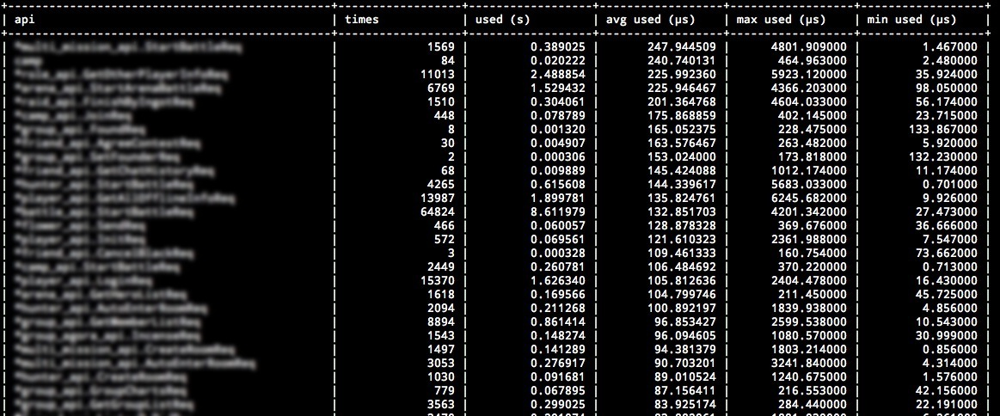

<!DOCTYPE html>
<html>
	<head>
		<meta charset="utf-8">
<meta http-equiv="X-UA-Compatible" content="IE=edge">
<meta name="viewport" content="width=device-width, initial-scale=1.0, maximum-scale=1.0, user-scalable=no">
<meta name="author" content="slene, Unknown" />

<title>Toolbox Module - beego: simple &amp; powerful Go app framework</title>

<link rel="shortcut icon" href="/static/img/favicon.png" />

	<link rel="stylesheet" href="/static_source/css/bootstrap.css?ver=1409586500" />
	<link rel="stylesheet" href="/static_source/css/bootstrap-theme.css?ver=1409586500" />
	<link rel="stylesheet" href="/static_source/css/font-awesome.min.css?ver=1409586500" />
	<link rel="stylesheet" href="/static_source/css/prettify.css?ver=1409586500" />
	<link rel="stylesheet" href="/static_source/css/select2.css?ver=1409586500" />
	
<!--[if IE 7]>

	<link rel="stylesheet" href="/static_source/css/font-awesome-ie7.min.css?ver=1409586500" />
	
<![endif]-->

	<link rel="stylesheet" href="/static_source/css/base.css?ver=1409586500" />
	<link rel="stylesheet" href="/static_source/css/markdown.css?ver=1409586500" />
	<link rel="stylesheet" href="/static_source/css/main.css?ver=1409586500" />
	

<!--[if lt IE 9]>
	
	
	
	
<![endif]-->
		
	</head>
	<body id="front">
		<noscript>Please enable JavaScript in your browser!</noscript>
		

			<nav class="navbar navbar-default navbar-fixed-top">
    

        

            

                
                
                    <a id="docs-collapse-btn" class="navbar-btn" data-toggle="jpanel-menu" data-target="#docs-collapse">
                        Toggle docs menu
                        <i class="icon icon-angle-right"></i>
                    </a>
                
                
                <a type="button" class="navbar-toggle" data-toggle="collapse" data-target="#navbar-collapse">
                    Toggle navigation
                    
                    
                    
                </a>
                
                

                    <a class="navbar-brand" href="/">
                        Beego
                    </a>
                    
                    
                        
                    
                    
                

            

            

                <ul class="nav navbar-nav">
                    <li ><a href="/">Home</a></li>
                    <li ><a href="/quickstart">Getting started</a></li>
                    <li ><a href="/community">Community</a></li>
                    <li class="active"><a href="/docs/intro/">Documentation</a></li>
                    <li ><a href="/video">Video</a></li>
                    <li ><a href="/products">Products</a></li>
                    <li ><a href="/blog">Blog</a></li>
                </ul>
                

                    

                        <button type="button" class="btn btn-xs btn-default btn-md dropdown-toggle" data-toggle="dropdown">Language:English <i class="caret"></i></button>
                        <ul class="dropdown-menu">
                            
                                <li><a href="javascript::" data-lang="zh-CN" class="lang-changed">简体中文</a></li>
                            
                                <li><a href="javascript::" data-lang="ru-RU" class="lang-changed">Russian</a></li>
                            
                        </ul>
                    

                

                

                    
                    
                

            

        

    

</nav>
			

				

    

        

            

                
                    
                    
    
        
            <ul class="list-unstyled">
                
            </ul>
        
            <ul class="list-unstyled">
                
                    
                        <li class="group">
                            

                            
                                <a class=" item" href="/docs/intro/">Beego introduction</a>
                            
                            

                            
    
        
            <ul class="list-unstyled">
                
                    
                        <li><a class=" item" href="/docs/intro/contributing.md">Contributing</a></li>
                    
                
            </ul>
        
            <ul class="list-unstyled">
                
                    
                        <li><a class=" item" href="/docs/intro/releases.md">Release Notes</a></li>
                    
                
            </ul>
        
    

                        </li>
                    
                
            </ul>
        
            <ul class="list-unstyled">
                
                    
                        <li class="group">
                            

                            
                                <a class=" item" href="/docs/install/">Install / Upgrade</a>
                            
                            

                            
    
        
            <ul class="list-unstyled">
                
                    
                        <li><a class=" item" href="/docs/install/bee.md">bee tool usage</a></li>
                    
                
            </ul>
        
    

                        </li>
                    
                
            </ul>
        
            <ul class="list-unstyled">
                
                    
                        <li class="group">
                            

                            
                                <a class=" item" href="/docs/quickstart/">Quickstart</a>
                            
                            

                            
    
        
            <ul class="list-unstyled">
                
                    
                        <li><a class=" item" href="/docs/quickstart/new.md">Create a new project</a></li>
                    
                
            </ul>
        
            <ul class="list-unstyled">
                
                    
                        <li><a class=" item" href="/docs/quickstart/router.md">Routing settings</a></li>
                    
                
            </ul>
        
            <ul class="list-unstyled">
                
                    
                        <li><a class=" item" href="/docs/quickstart/controller.md">Controller</a></li>
                    
                
            </ul>
        
            <ul class="list-unstyled">
                
                    
                        <li><a class=" item" href="/docs/quickstart/model.md">Models</a></li>
                    
                
            </ul>
        
            <ul class="list-unstyled">
                
                    
                        <li><a class=" item" href="/docs/quickstart/view.md">View</a></li>
                    
                
            </ul>
        
            <ul class="list-unstyled">
                
                    
                        <li><a class=" item" href="/docs/quickstart/static.md">Static files</a></li>
                    
                
            </ul>
        
    

                        </li>
                    
                
            </ul>
        
            <ul class="list-unstyled">
                
                    
                        <li class="group">
                            

                            
                                <a class=" item" href="/docs/mvc/">MVC Introduction</a>
                            
                            

                            
    
        
            <ul class="list-unstyled">
                
                    
                        <li class="group">
                            

                            
                                Controllers
                            
                            

                            
    
        
            <ul class="list-unstyled">
                
                    
                        <li><a class=" item" href="/docs/mvc/controller/config.md">Configuration</a></li>
                    
                
            </ul>
        
            <ul class="list-unstyled">
                
                    
                        <li><a class=" item" href="/docs/mvc/controller/router.md">Routing</a></li>
                    
                
            </ul>
        
            <ul class="list-unstyled">
                
                    
                        <li><a class=" item" href="/docs/mvc/controller/controller.md">Controller funcs</a></li>
                    
                
            </ul>
        
            <ul class="list-unstyled">
                
                    
                        <li><a class=" item" href="/docs/mvc/controller/xsrf.md">XSRF filtering</a></li>
                    
                
            </ul>
        
            <ul class="list-unstyled">
                
                    
                        <li><a class=" item" href="/docs/mvc/controller/params.md">Request parameters</a></li>
                    
                
            </ul>
        
            <ul class="list-unstyled">
                
                    
                        <li><a class=" item" href="/docs/mvc/controller/session.md">Session control</a></li>
                    
                
            </ul>
        
            <ul class="list-unstyled">
                
                    
                        <li><a class=" item" href="/docs/mvc/controller/filter.md">Filters</a></li>
                    
                
            </ul>
        
            <ul class="list-unstyled">
                
                    
                        <li><a class=" item" href="/docs/mvc/controller/flash.md">Flash messages</a></li>
                    
                
            </ul>
        
            <ul class="list-unstyled">
                
                    
                        <li><a class=" item" href="/docs/mvc/controller/urlbuilding.md">URL Building</a></li>
                    
                
            </ul>
        
            <ul class="list-unstyled">
                
                    
                        <li><a class=" item" href="/docs/mvc/controller/jsonxml.md">Response formats</a></li>
                    
                
            </ul>
        
            <ul class="list-unstyled">
                
                    
                        <li><a class=" item" href="/docs/mvc/controller/validation.md">Form validation</a></li>
                    
                
            </ul>
        
            <ul class="list-unstyled">
                
                    
                        <li><a class=" item" href="/docs/mvc/controller/errors.md">Error Handling</a></li>
                    
                
            </ul>
        
            <ul class="list-unstyled">
                
                    
                        <li><a class=" item" href="/docs/mvc/controller/logs.md">Logging</a></li>
                    
                
            </ul>
        
    

                        </li>
                    
                
            </ul>
        
            <ul class="list-unstyled">
                
                    
                        <li class="group">
                            

                            
                                Models
                            
                            

                            
    
        
            <ul class="list-unstyled">
                
                    
                        <li><a class=" item" href="/docs/mvc/model/overview.md">Overview</a></li>
                    
                
            </ul>
        
            <ul class="list-unstyled">
                
                    
                        <li><a class=" item" href="/docs/mvc/model/orm.md">ORM Usage</a></li>
                    
                
            </ul>
        
            <ul class="list-unstyled">
                
                    
                        <li><a class=" item" href="/docs/mvc/model/object.md">CRUD Operations</a></li>
                    
                
            </ul>
        
            <ul class="list-unstyled">
                
                    
                        <li><a class=" item" href="/docs/mvc/model/query.md">Advanced Queries</a></li>
                    
                
            </ul>
        
            <ul class="list-unstyled">
                
                    
                        <li><a class=" item" href="/docs/mvc/model/rawsql.md">Raw SQL to query</a></li>
                    
                
            </ul>
        
            <ul class="list-unstyled">
                
                    
                        <li><a class=" item" href="/docs/mvc/model/querybuilder.md">Query Builder</a></li>
                    
                
            </ul>
        
            <ul class="list-unstyled">
                
                    
                        <li><a class=" item" href="/docs/mvc/model/transaction.md">Transaction</a></li>
                    
                
            </ul>
        
            <ul class="list-unstyled">
                
                    
                        <li><a class=" item" href="/docs/mvc/model/models.md">Model Definition</a></li>
                    
                
            </ul>
        
            <ul class="list-unstyled">
                
                    
                        <li><a class=" item" href="/docs/mvc/model/cmd.md">Command Line</a></li>
                    
                
            </ul>
        
            <ul class="list-unstyled">
                
                    
                        <li><a class=" item" href="/docs/mvc/model/test.md">Test Cases</a></li>
                    
                
            </ul>
        
            <ul class="list-unstyled">
                
                    
                        <li><a class=" item" href="/docs/mvc/model/custom_fields.md">Custom Fields</a></li>
                    
                
            </ul>
        
            <ul class="list-unstyled">
                
                    
                        <li><a class=" item" href="/docs/mvc/model/faq.md">FAQ</a></li>
                    
                
            </ul>
        
    

                        </li>
                    
                
            </ul>
        
            <ul class="list-unstyled">
                
                    
                        <li class="group">
                            

                            
                                Views
                            
                            

                            
    
        
            <ul class="list-unstyled">
                
                    
                        <li><a class=" item" href="/docs/mvc/view/view.md">Template Parsing</a></li>
                    
                
            </ul>
        
            <ul class="list-unstyled">
                
                    
                        <li><a class=" item" href="/docs/mvc/view/template.md">Template Functions</a></li>
                    
                
            </ul>
        
            <ul class="list-unstyled">
                
                    
                        <li><a class=" item" href="/docs/mvc/view/static.md">Static files</a></li>
                    
                
            </ul>
        
            <ul class="list-unstyled">
                
                    
                        <li><a class=" item" href="/docs/mvc/view/page.md">Pagination</a></li>
                    
                
            </ul>
        
    

                        </li>
                    
                
            </ul>
        
    

                        </li>
                    
                
            </ul>
        
            <ul class="list-unstyled">
                
                    
                        <li class="group">
                            

                            
                                <a class=" item" href="/docs/module/">Modules</a>
                            
                            

                            
    
        
            <ul class="list-unstyled">
                
                    
                        <li><a class=" item" href="/docs/module/session.md">Session Module</a></li>
                    
                
            </ul>
        
            <ul class="list-unstyled">
                
                    
                        <li><a class=" item" href="/docs/module/cache.md">Cache Module</a></li>
                    
                
            </ul>
        
            <ul class="list-unstyled">
                
                    
                        <li><a class=" item" href="/docs/module/logs.md">Logs Module</a></li>
                    
                
            </ul>
        
            <ul class="list-unstyled">
                
                    
                        <li><a class=" item" href="/docs/module/httplib.md">Httplib Module</a></li>
                    
                
            </ul>
        
            <ul class="list-unstyled">
                
                    
                        <li><a class=" item" href="/docs/module/context.md">Context Module</a></li>
                    
                
            </ul>
        
            <ul class="list-unstyled">
                
                    
                        <li><a class="active item" href="/docs/module/toolbox.md">Toolbox Module</a></li>
                    
                
            </ul>
        
            <ul class="list-unstyled">
                
                    
                        <li><a class=" item" href="/docs/module/config.md">Config Module</a></li>
                    
                
            </ul>
        
            <ul class="list-unstyled">
                
                    
                        <li><a class=" item" href="/docs/module/i18n.md">i18n Module</a></li>
                    
                
            </ul>
        
    

                        </li>
                    
                
            </ul>
        
            <ul class="list-unstyled">
                
                    
                        <li class="group">
                            

                            
                                <a class=" item" href="/docs/advantage/">Advanced Beego</a>
                            
                            

                            
    
        
            <ul class="list-unstyled">
                
                    
                        <li><a class=" item" href="/docs/advantage/monitor.md">Live Monitor</a></li>
                    
                
            </ul>
        
            <ul class="list-unstyled">
                
                    
                        <li><a class=" item" href="/docs/advantage/docs.md">Automated API Documentation</a></li>
                    
                
            </ul>
        
    

                        </li>
                    
                
            </ul>
        
            <ul class="list-unstyled">
                
                    
                        <li class="group">
                            

                            
                                <a class=" item" href="/docs/deploy/">Deployment</a>
                            
                            

                            
    
        
            <ul class="list-unstyled">
                
                    
                        <li><a class=" item" href="/docs/deploy/beego.md">Stand alone Deployment</a></li>
                    
                
            </ul>
        
            <ul class="list-unstyled">
                
                    
                        <li><a class=" item" href="/docs/deploy/supervisor.md">Deployment with Supervisord</a></li>
                    
                
            </ul>
        
            <ul class="list-unstyled">
                
                    
                        <li><a class=" item" href="/docs/deploy/systemctl.md">Deployment with Systemctl</a></li>
                    
                
            </ul>
        
            <ul class="list-unstyled">
                
                    
                        <li><a class=" item" href="/docs/deploy/nginx.md">Deployment with nginx</a></li>
                    
                
            </ul>
        
            <ul class="list-unstyled">
                
                    
                        <li><a class=" item" href="/docs/deploy/apache.md">Deployment with Apache</a></li>
                    
                
            </ul>
        
    

                        </li>
                    
                
            </ul>
        
            <ul class="list-unstyled">
                
                    
                        <li class="group">
                            

                            
                                <a class=" item" href="/docs/contributed/">Middleware contribution</a>
                            
                            

                            
    
        
    

                        </li>
                    
                
            </ul>
        
            <ul class="list-unstyled">
                
                    
                        <li class="group">
                            

                            
                                <a class=" item" href="/docs/examples/">Demos</a>
                            
                            

                            
    
        
            <ul class="list-unstyled">
                
                    
                        <li><a class=" item" href="/docs/examples/chat.md">Chat Room</a></li>
                    
                
            </ul>
        
            <ul class="list-unstyled">
                
                    
                        <li><a class=" item" href="/docs/examples/shorturl.md">URL Shortener</a></li>
                    
                
            </ul>
        
            <ul class="list-unstyled">
                
                    
                        <li><a class=" item" href="/docs/examples/todo.md">To-do List</a></li>
                    
                
            </ul>
        
    

                        </li>
                    
                
            </ul>
        
            <ul class="list-unstyled">
                
                    
                        <li class="group">
                            

                            
                                <a class=" item" href="/docs/faq/">FAQ</a>
                            
                            

                            
    
        
    

                        </li>
                    
                
            </ul>
        
    

                
            

        

        

            

				

					
					<gcse:search></gcse:search>
				

                

                    

                        <a href="https://github.com/beego/beedoc/blob/master/en-US/module/toolbox.md" class="pull-right btn btn-info" target="_blank">Improve this page on GitHub</a>
                        
                    

                    

                        <!DOCTYPE html PUBLIC "-//W3C//DTD XHTML 1.0 Transitional//EN" "http://www.w3.org/TR/xhtml1/DTD/xhtml1-transitional.dtd">
<html xmlns="http://www.w3.org/1999/xhtml">
<head>
  <title></title>
  <meta name="GENERATOR" content="Blackfriday Markdown Processor v1.1" />
  <meta charset="utf-8" />
</head>
<body>

<h1>Core Toolbox Module</h1>

This module is based on the <a href="https://github.com/dropwizard/dropwizard">Dropwizard framework</a> for Java. One user told me about this framework and it&rsquo;s cool stuff. <a href="https://github.com/astaxie/beego/issues/128">Issue 128</a> talked about this feature. I added more cool features. Here are the features: healthcheck, profiling, statistics and tasks.

<h2>Installation</h2>

<pre><code>go get github.com/astaxie/beego/toolbox
</code></pre>

<h2>Healthcheck</h2>

It can check the health status of your application. E.g.: To check if database is available:

<pre><code>type DatabaseCheck struct {
}

func (dc *DatabaseCheck) Check() error {
    if dc.isConnected() {
        return nil
    } else {
        return errors.New(&quot;can't connect database&quot;)
    }
}
</code></pre>

Then you can add it as a check item:

<pre><code>toolbox.AddHealthCheck(&quot;database&quot;,&amp;DatabaseCheck{})
</code></pre>

After this you can send get request to <code>/healthcheck</code>:

<pre><code>$ curl http://beego.me:8088/healthcheck
* deadlocks: OK
* database: OK
</code></pre>

It will return the database status accordingly.

<h2>Profiling</h2>

Monitoring the performance of running processes is a very good way to optimize performance and to look for issues in our application. E.g.: information of GC and goroutine.

Profile provides a easy entry point for you to debug the application. It uses the <code>ProcessInput</code> entry function to process the requests. Here are some debugging types:

<ul>
<li>
lookup goroutine

Print out the tasks of all goroutines which are currently running. You can easily see what all goroutines are doing.

<pre><code>goroutine 3 [running]:
runtime/pprof.writeGoroutineStacks(0x634238, 0xc210000008, 0x62b000, 0xd200000000000000)
    /Users/astaxie/go/src/pkg/runtime/pprof/pprof.go:511 +0x7c
runtime/pprof.writeGoroutine(0x634238, 0xc210000008, 0x2, 0xd2676410957b30fd, 0xae98)
    /Users/astaxie/go/src/pkg/runtime/pprof/pprof.go:500 +0x3c
runtime/pprof.(*Profile).WriteTo(0x52ebe0, 0x634238, 0xc210000008, 0x2, 0x1, ...)
    /Users/astaxie/go/src/pkg/runtime/pprof/pprof.go:229 +0xb4
_/Users/astaxie/github/beego/toolbox.ProcessInput(0x2c89f0, 0x10, 0x634238, 0xc210000008)
    /Users/astaxie/github/beego/toolbox/profile.go:26 +0x256
_/Users/astaxie/github/beego/toolbox.TestProcessInput(0xc21004e090)
    /Users/astaxie/github/beego/toolbox/profile_test.go:9 +0x5a
testing.tRunner(0xc21004e090, 0x532320)
    /Users/astaxie/go/src/pkg/testing/testing.go:391 +0x8b
created by testing.RunTests
    /Users/astaxie/go/src/pkg/testing/testing.go:471 +0x8b2

goroutine 1 [chan receive]:
testing.RunTests(0x315668, 0x532320, 0x4, 0x4, 0x1)
    /Users/astaxie/go/src/pkg/testing/testing.go:472 +0x8d5
testing.Main(0x315668, 0x532320, 0x4, 0x4, 0x537700, ...)
    /Users/astaxie/go/src/pkg/testing/testing.go:403 +0x84
main.main()
    _/Users/astaxie/github/beego/toolbox/_test/_testmain.go:53 +0x9c
</code></pre></li>

<li>
lookup heap

Print out information of current heap:

<pre><code>heap profile: 1: 288 [2: 296] @ heap/1048576
1: 288 [2: 296] @

# runtime.MemStats
# Alloc = 275504
# TotalAlloc = 275512
# Sys = 4069608
# Lookups = 5
# Mallocs = 469
# Frees = 1
# HeapAlloc = 275504
# HeapSys = 1048576
# HeapIdle = 647168
# HeapInuse = 401408
# HeapReleased = 0
# HeapObjects = 468
# Stack = 24576 / 131072
# MSpan = 4472 / 16384
# MCache = 1504 / 16384
# BuckHashSys = 1476472
# NextGC = 342976
# PauseNs = [370712 77378 0 0 0 0 0 0 0 0 0 0 0 0 0 0 0 0 0 0 0 0 0 0 0 0 0 0 0 0 0 0 0 0 0 0 0 0 0 0 0 0 0 0 0 0 0 0 0 0 0 0 0 0 0 0 0 0 0 0 0 0 0 0 0 0 0 0 0 0 0 0 0 0 0 0 0 0 0 0 0 0 0 0 0 0 0 0 0 0 0 0 0 0 0 0 0 0 0 0 0 0 0 0 0 0 0 0 0 0 0 0 0 0 0 0 0 0 0 0 0 0 0 0 0 0 0 0 0 0 0 0 0 0 0 0 0 0 0 0 0 0 0 0 0 0 0 0 0 0 0 0 0 0 0 0 0 0 0 0 0 0 0 0 0 0 0 0 0 0 0 0 0 0 0 0 0 0 0 0 0 0 0 0 0 0 0 0 0 0 0 0 0 0 0 0 0 0 0 0 0 0 0 0 0 0 0 0 0 0 0 0 0 0 0 0 0 0 0 0 0 0 0 0 0 0 0 0 0 0 0 0 0 0 0 0 0 0 0 0 0 0 0 0 0 0 0 0 0 0 0 0 0 0 0 0]
# NumGC = 2
# EnableGC = true
# DebugGC = false
</code></pre></li>

<li>
lookup threadcreate

Print out information of threads:

<pre><code>threadcreate profile: total 4
1 @ 0x17f68 0x183c7 0x186a8 0x188cc 0x19ca9 0xcf41 0x139a3 0x196c0
#   0x183c7 newm+0x27           /Users/astaxie/go/src/pkg/runtime/proc.c:896
#   0x186a8 startm+0xb8         /Users/astaxie/go/src/pkg/runtime/proc.c:974
#   0x188cc handoffp+0x1ac          /Users/astaxie/go/src/pkg/runtime/proc.c:992
#   0x19ca9 runtime.entersyscallblock+0x129 /Users/astaxie/go/src/pkg/runtime/proc.c:1514
#   0xcf41  runtime.notetsleepg+0x71    /Users/astaxie/go/src/pkg/runtime/lock_sema.c:253
#   0x139a3 runtime.MHeap_Scavenger+0xa3    /Users/astaxie/go/src/pkg/runtime/mheap.c:463

1 @ 0x17f68 0x183c7 0x186a8 0x188cc 0x189c3 0x1969b 0x2618b
#   0x183c7 newm+0x27       /Users/astaxie/go/src/pkg/runtime/proc.c:896
#   0x186a8 startm+0xb8     /Users/astaxie/go/src/pkg/runtime/proc.c:974
#   0x188cc handoffp+0x1ac      /Users/astaxie/go/src/pkg/runtime/proc.c:992
#   0x189c3 stoplockedm+0x83    /Users/astaxie/go/src/pkg/runtime/proc.c:1049
#   0x1969b runtime.gosched0+0x8b   /Users/astaxie/go/src/pkg/runtime/proc.c:1382
#   0x2618b runtime.mcall+0x4b  /Users/astaxie/go/src/pkg/runtime/asm_amd64.s:178

1 @ 0x17f68 0x183c7 0x170bc 0x196c0
#   0x183c7 newm+0x27       /Users/astaxie/go/src/pkg/runtime/proc.c:896
#   0x170bc runtime.main+0x3c   /Users/astaxie/go/src/pkg/runtime/proc.c:191

1 @
</code></pre></li>

<li>
lookup block

Print out information of block:

<pre><code>--- contention:
cycles/second=2294781025
</code></pre></li>

<li>
start cpuprof

Start recording cpuprof info into created file cpu-pid.pprof.
</li>

<li>
stop cpuprof

Stop recording.
</li>

<li>
get memprof

Start recording memprof into created file mem-pid.memprof
</li>

<li>
gc summary

Check GC status:

<pre><code>NumGC:2 Pause:54.54us Pause(Avg):170.82us Overhead:177.49% Alloc:248.97K Sys:3.88M Alloc(Rate):1.23G/s Histogram:287.09us 287.09us 287.09us 
</code></pre></li>
</ul>

<h2>Statistics</h2>

Look at this picture, what do you think? It&rsquo;s cool, right? Toolbox module supports it.

How can I use the statistics? Add statistics like this:

<pre><code>toolbox.StatisticsMap.AddStatistics(&quot;POST&quot;, &quot;/api/user&quot;, &quot;&amp;admin.user&quot;, time.Duration(2000))
toolbox.StatisticsMap.AddStatistics(&quot;POST&quot;, &quot;/api/user&quot;, &quot;&amp;admin.user&quot;, time.Duration(120000))
toolbox.StatisticsMap.AddStatistics(&quot;GET&quot;, &quot;/api/user&quot;, &quot;&amp;admin.user&quot;, time.Duration(13000))
toolbox.StatisticsMap.AddStatistics(&quot;POST&quot;, &quot;/api/admin&quot;, &quot;&amp;admin.user&quot;, time.Duration(14000))
toolbox.StatisticsMap.AddStatistics(&quot;POST&quot;, &quot;/api/user/astaxie&quot;, &quot;&amp;admin.user&quot;, time.Duration(12000))
toolbox.StatisticsMap.AddStatistics(&quot;POST&quot;, &quot;/api/user/xiemengjun&quot;, &quot;&amp;admin.user&quot;, time.Duration(13000))
toolbox.StatisticsMap.AddStatistics(&quot;DELETE&quot;, &quot;/api/user&quot;, &quot;&amp;admin.user&quot;, time.Duration(1400))
</code></pre>

Get statistics information:

<pre><code>toolbox.StatisticsMap.GetMap(os.Stdout) 
</code></pre>

Here is the output:

<pre><code>| requestUrl                                        | method     | times            | used             | max used         | min used         | avg used         |
| /api/user                                         | POST       |  2               | 122.00us         | 120.00us         | 2.00us           | 61.00us          |
| /api/user                                         | GET        |  1               | 13.00us          | 13.00us          | 13.00us          | 13.00us          |
| /api/user                                         | DELETE     |  1               | 1.40us           | 1.40us           | 1.40us           | 1.40us           |
| /api/admin                                        | POST       |  1               | 14.00us          | 14.00us          | 14.00us          | 14.00us          |
| /api/user/astaxie                                 | POST       |  1               | 12.00us          | 12.00us          | 12.00us          | 12.00us          |
| /api/user/xiemengjun                              | POST       |  1               | 13.00us          | 13.00us          | 13.00us          | 13.00us          |   
</code></pre>

<h2>Tasks</h2>

Tasks work very similarly to cron jobs. Tasks are used to run a job outside the normal request/response cycle. These can be adhoc or scheduled to run regularly. 
Examples include: Reporting memory and goroutine status, periodically triggering GC or cleaning up log files at fixed intervals.

<h3>Creating a new Task</h3>

To initialize a task implement <a href="toolbox.NewTask">https://godoc.org/github.com/astaxie/beego/toolbox#NewTask</a>:

<pre><code>tk1 := toolbox.NewTask(&quot;tk1&quot;, &quot;0 12 * * * *&quot;, func() error {
    fmt.Println(&quot;tk1&quot;)
    return nil
})
</code></pre>

The NewTask signature:

<pre><code>NewTask(tname string, spec string, f TaskFunc) *Task    
</code></pre>

<ul>
<li><code>tname</code>: Task name </li>
<li><code>spec</code>: Task format. See below for details. </li>
<li><code>f</code>: The function which will be run as the task. </li>
</ul>

To implement this task, add it to the global task list and start it.

<pre><code>toolbox.AddTask(&quot;tk1&quot;, tk1)
toolbox.StartTask()
defer toolbox.StopTask()
</code></pre>

<h3>Testing the TaskFunc</h3>

Use the code below to test if the TaskFunc is working correctly.

<pre><code>err := tk.Run()
if err != nil {
    t.Fatal(err)
}
</code></pre>

<h3>spec in detail</h3>

<code>spec</code> specifies when the new Task will be run. Its format is the same as that of traditional crontab:

<pre><code>// The first 6 parts are:
//       second: 0-59
//       minute: 0-59
//       hour: 1-23
//       day: 1-31
//       month: 1-12
//       weekdays: 0-6（0 is Sunday）

// Some special sign:
//       *: any time
//       ,: separator. E.g.: 2,4 in the third part means run at 2 and 4 o'clock
//　　    －: range. E.g.: 1-5 in the third part means run between 1 and 5 o'clock
//       /n : run once every n time. E.g.: */1 in the third part means run once every an hour. Same as 1-23/1
/////////////////////////////////////////////////////////
//  0/30 * * * * *                        run every 30 seconds
//  0 43 21 * * *                         run at 21:43
//  0 15 05 * * *                         run at 05:15
//  0 0 17 * * *                          run at 17:00
//  0 0 17 * * 1                          run at 17:00 of every Monday
//  0 0,10 17 * * 0,2,3                   run at 17:00 and 17:10 of every Sunday, Tuesday and Wednesday
//  0 0-10 17 1 * *                       run once every minute from 17:00 to 7:10 on 1st day of every month
//  0 0 0 1,15 * 1                        run at 0:00 on 1st and 15th of each month and every Monday
//  0 42 4 1 * *                          run at 4:42 on 1st of every month
//  0 0 21 * * 1-6                        run at 21:00 from Monday to Saturday
//  0 0,10,20,30,40,50 * * * *            run every 10 minutes
//  0 */10 * * * *                        run every 10 minutes
//  0 * 1 * * *                           run every one minute from 1:00 to 1:59
//  0 0 1 * * *                           run at 1:00
//  0 0 */1 * * *                         run at :00 of every hour
//  0 0 * * * *                           run at :00 of every hour
//  0 2 8-20/3 * * *                      run at 8:02, 11:02, 14:02, 17:02 and 20:02
//  0 30 5 1,15 * *                       run at 5:30 of 1st and 15th of every month
</code></pre>

<h2>Debug module (Already moved to utils module)</h2>

We always use print for debugging. But the default output is not good enough for debugging. Beego provides this debug module

<ul>
<li>Display() print result to console </li>
<li>GetDisplayString() return the string </li>
</ul>

It print key/value pairs. The following code:

<pre><code>Display(&quot;v1&quot;, 1, &quot;v2&quot;, 2, &quot;v3&quot;, 3)
</code></pre>

will output:

<pre><code>2013/12/16 23:48:41 [Debug] at TestPrint() [/Users/astaxie/github/beego/toolbox/debug_test.go:13]

[Variables]
v1 = 1
v2 = 2
v3 = 3  
</code></pre>

For pointer type:

<pre><code>type mytype struct {
    next *mytype
    prev *mytype
}   

var v1 = new(mytype)
var v2 = new(mytype)

v1.prev = nil
v1.next = v2

v2.prev = v1
v2.next = nil

Display(&quot;v1&quot;, v1, &quot;v2&quot;, v2)
</code></pre>

The output result

<pre><code>2013/12/16 23:48:41 [Debug] at TestPrintPoint() [/Users/astaxie/github/beego/toolbox/debug_test.go:26]

[Variables]
v1 = &amp;toolbox.mytype{
    next: &amp;toolbox.mytype{
        next: nil,
        prev: 0x210335420,
    },
    prev: nil,
}
v2 = &amp;toolbox.mytype{
    next: nil,
    prev: &amp;toolbox.mytype{
        next: 0x210335430,
        prev: nil,
    },
}       
</code></pre>

</body>
</html>

                    

                

            

            
            

<noscript>Please enable JavaScript to view the <a href="http://disqus.com/?ref_noscript">comments powered by Disqus.</a></noscript>
<a href="http://disqus.com" class="dsq-brlink">comments powered by Disqus</a>
        

    

		    

		    

		

		<footer id="footer">
    

        

            

                

                    

                        <button type="button" class="btn btn-default btn-md dropdown-toggle" data-toggle="dropdown">Language:English <i class="caret"></i></button>
                        <ul class="dropdown-menu">
                            
                                <li><a href="javascript::" data-lang="zh-CN" class="lang-changed">简体中文</a></li>
                            
                                <li><a href="javascript::" data-lang="ru-RU" class="lang-changed">Russian</a></li>
                            
                        </ul>
                    

                    
                    
                        <a class="btn btn-success" href="/donate"><i class="icon-dollar"></i> Donate Us</a>
                    
                

                
                

                    <a href="/about"><strong>About</strong></a>
                    |
                    <a href="/team"><strong>Team</strong></a>
                    |
                    <a target="_blank" href="https://github.com/astaxie/beego" target="_blank"><strong><i class="icon-github-sign"></i> Github</strong></a>
                    - 24ms.
                

                

                    Copyright © 2012-2014 Beego Under the <a href="http://www.apache.org/licenses/LICENSE-2.0.html">apache 2.0 licence</a>. Logo designed by <a target="_blank" href="http://mdong.org">Tengfei</a>.
                

            

        

    

</footer>

	
	
	
	
	
	
	
	
	
	
	
	

	
	
	</body>
</html>

